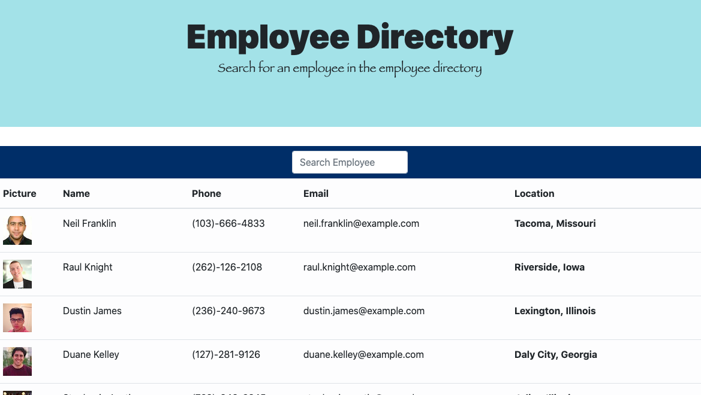

# Employee Directory

# Created by Alyssa Hollowell

# Getting Started with Create React App

This application was bootstrapped with [Create React App](https://github.com/facebook/create-react-app).

## Available Scripts

In the application directory, you can run:

### `npm start`

Runs the app in the development mode.
Open [http://localhost:3000](http://localhost:3000) to view it in the browser.

The page will reload if you make edits.

# Description
The user is able to view the entire employee directory and also filter employees by name.
The application shows the employees picture, name, phone number, email, and location.

# Application Screenshot

# Application Link
[https://alyssah1.github.io/Employee-directory/](https://alyssah1.github.io/Employee-directory/)

# Questions
If you have any questions please use the contacts down below:

Email address: alyssa.hollowell2@gmail.com

GitHub account: alyssah1

